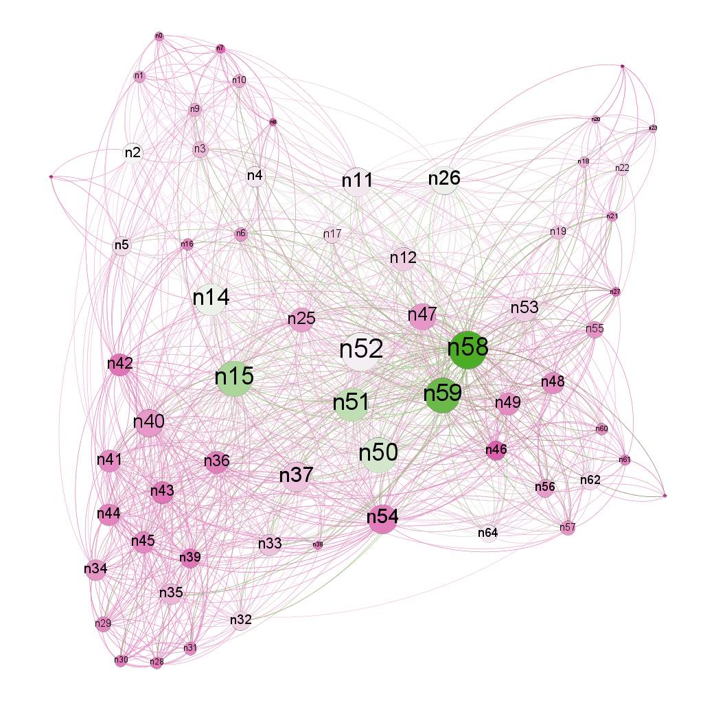
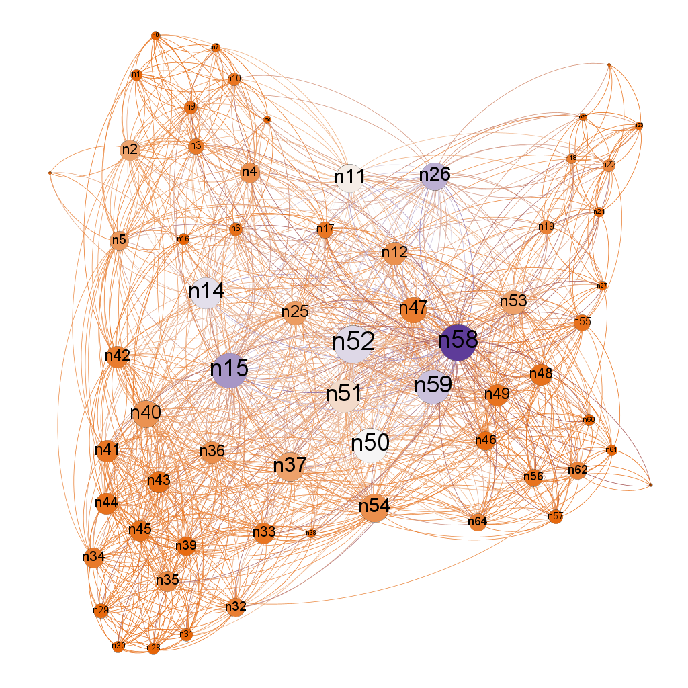
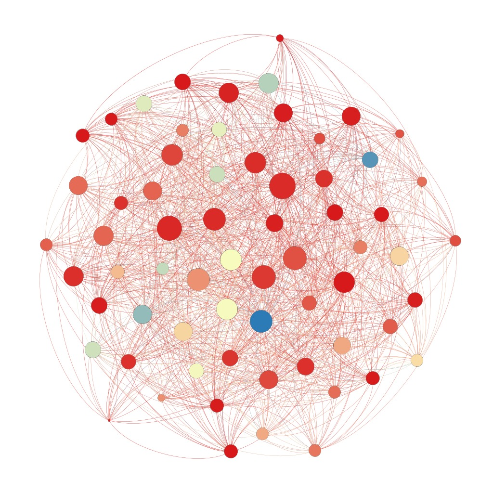
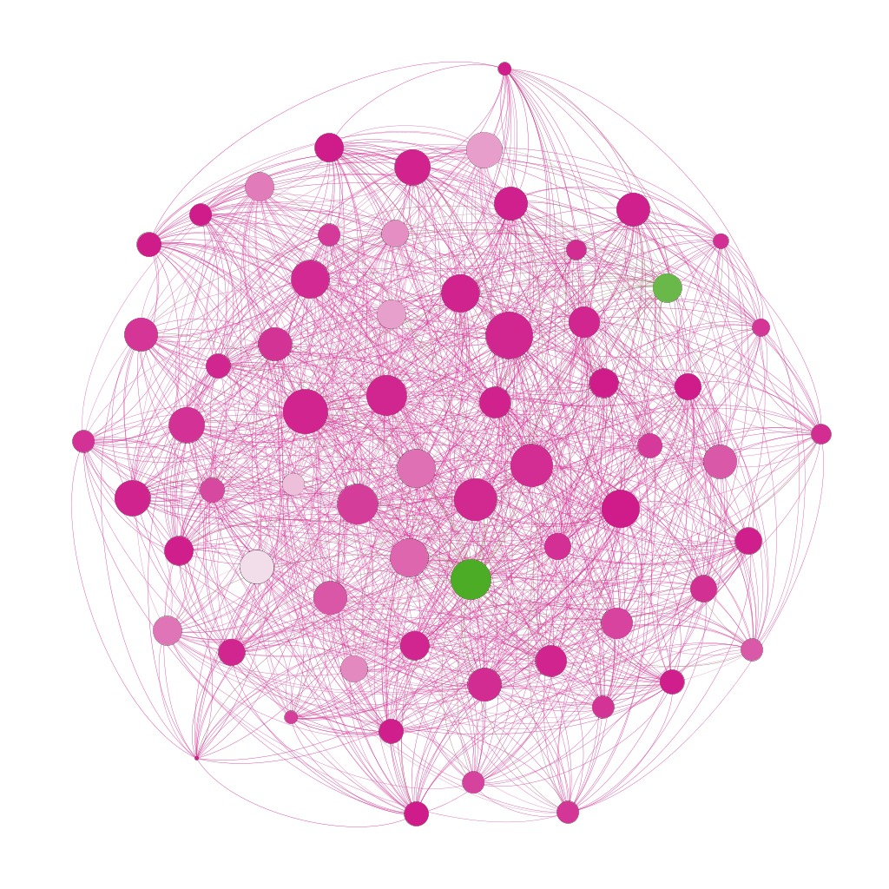
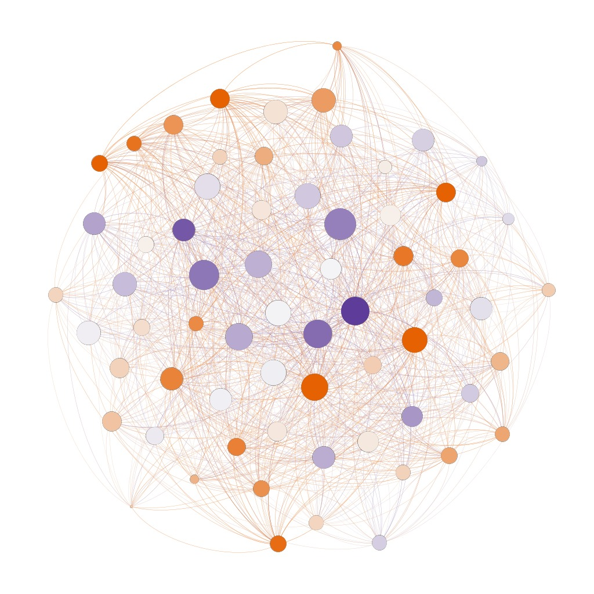

# P3

## Apresentação

O presente projeto foi originado no contexto das atividades da disciplina de pós-graduação [*Ciência e Visualização de Dados em Saúde*](https://ds4h.org), oferecida no primeiro semestre de 2022, na Unicamp.

|          **Nome**           | **RA** | **Especialização** |
| :-------------------------: | :----: | :----------------: |
| Leonardo Rodrigues da Costa | 146895 |       Física       |
| Luiz Fellipe Machi Pereira  | 203532 |     Computação     |

## Referência bibliográfica do artigo lido

[Rich Club Organization and Intermodule Communication in the Cat Connectom](https://doi.org/10.1523/JNEUROSCI.1448-13.2013)

## Resumo

O artigo em questão tem como foco a identificação de *rich clubs* nos cérebros de mamíferos, uma vez que poderiam representar uma infraestrutura de comunicação muito eficiente, ou seja, valores baixos para caminhos mínimos médios entre os diferentes domínios do cérebro. *Rich clubs* são padrões de conexão em que os nós com mais conexões na rede também apresentam uma alta conectividade entre si. Os autores utilizaram uma rede de conectividade de cérebros de gatos para evidenciar a importância de *rich clubs* estruturais em interligar domínios funcionais. A rede em questão foi reconstruída a partir de dados neuroanatômicos da literatura, que observaram como os tratos neuronais conectam diferentes regiões funcionais no córtex do gato. Para provar seu ponto, o autor demonstra que pelo menos 90% dos caminhos de comunicação inter-modais envolvem ou atravessam *rich clubs*. Entre os experimentos realizados pelo autor estão: a distinção de macro-módulos funcionais do cérebro, a identificação de *rich clubs* e sua participação nos módulos funcionais, cálculo de centralidade e homogeneidade dos *rich clubs*, além da análise de motifs de caminhos de comunicação.

## Breve descrição do experimento/análise do artigo que foi replicado

O artigo analisado propõe caracterizar a presença de *rich clubs* na estrutura da rede cerebral do gato. Para isso, o arranjo experimental se dividiu nas seguintes etapas:

  1. Detecção de comunidades: como a informação que gerou a rede é anatômica, a informação sobre as regiões que compõem cada um dos quatro módulos funcionais era sabida a priori. No entanto, o artigo usa um algoritmo de detecção de comunidades para tentar replicar essa classificação com grande sucesso.  O resultado foi: aproximadamente 18 nós (≅ 28%) do córtex visual, 10 (≅16%) nós do córtex auditivo, 18 nós (≅28%) do córtex motor frontal e 19 (≅30%) nós do córtex somato-límbico).
  2. Organização do *Rich Club*: o coeficiente de *rich club* 𝚽(k)  foi calculado para a rede e comparado com 𝚽(k) médio de redes aleatórias do mesmo tamanho. Dessa comparação resultou que a rede do cérebro do gato apresentava sim um *rich club*, composto pelos 15 nós de maior grau, ou seja, com maior número de conexões.
  3. Participação do *rich club* na rede: os nós do *rich club* obtiveram a maior conectividade dentro e fora de suas respectivas classes modulares, além disso receberam um rank mais alto nas medidas de:
     1. Centralidade de intermediação: taxa de caminhos mínimos que passam por um dado nó sobre todos caminhos mínimos possíveis da rede.
     2. PageRank: probabilidade que um determinado nó tem de ser acessado em uma caminhada aleatória infinita.

Em seguida, o artigo define uma modularidade *fuzzy*, no qual determinados nós podem pertencer a mais de um dos módulos funcionais simultaneamente. Depois disso é feita uma classificação das conexões: se as conexões são feitas com *rich club* internamente, se são entre nós internos de cada módulo, ou entre nós intramodulares. Não replicamos essas últimas etapas em nossos experimentos, uma vez que o software que escolhemos não dava suporte a esse tipo de tarefa.

### Dados usados como entrada

| Dataset                                                                  | Endereço na Web                                                                                | Resumo descritivo                                                                                                                                                                                                                                                                                                                                                                                                                                                                                    |
| ------------------------------------------------------------------------ | ---------------------------------------------------------------------------------------------- | ---------------------------------------------------------------------------------------------------------------------------------------------------------------------------------------------------------------------------------------------------------------------------------------------------------------------------------------------------------------------------------------------------------------------------------------------------------------------------------------------------- |
| [(Cat) Mixed.species_brain_1](https://neurodata.io/project/connectomes/) | [Link para base](https://s3.amazonaws.com/connectome-graphs/cat/mixed.species_brain_1.graphml) | O conjunto de dados de conectividade do gato compreende uma descrição das conexões corticocorticais no cérebro do gato. Nenhuma informação específica sobre o sexo dos animais incluídos estava disponível, sugerindo que o conjunto de dados inclui informações combinadas sobre a conectividade de gatos machos e fêmeas. O conjunto incorpora dados de um hemisfério, incluindo 65 regiões, ou nós, e 1139 projeções axonais macroscópicas inter-regionais, ou arestas, com a força das conexões. |

## Método

Nossas análises foram conduzidas no software Gephi, que permitiu visualizações da rede de conectividade e suas diferentes métricas. Como o Gephi não calcula o coeficiente de *rich club* optamos por utilizar a centralidade de autovetor, cuja definição se assemelha conceitualmente a dos *rich clubs*. A centralidade de autovetor mede quão importante é um nó da rede através de uma relação de recorrência: a centralidade de autovetor de um dado nó é a média das centralidades de autovetor dos seus vizinhos.  

Uma vez inserida a lista de arestas da rede no Gephi, performamos as seguintes operações:

- Calculamos grau, coeficiente de cluster e caminho mínimo médio da rede (Tabela 1);
- Escalamos o tamanhos dos nós de acordo com seu grau;
- Mudamos o layout do gráfico para o modelo de Yifan Hu;
- Fizemos a análise de modularidade e mudamos a cor dos nós de acordo com a classe funcional como na Figura 1;
- Repetimos o passo anterior para as medidas de centralidade de autovetor, PageRank e centralidade de intermediação (Figuras 2 à 4).
- Por fim, criamos um grafo aleatório com 65 nós e 1139 arestas e repetimos todos os passos anteriores para ele (Tabela 2 e Figuras 5-8), a título de comparação.

Relatórios complementares podem ser encontradas na pasta [reports](assets/reports).

### Resultados dos experimentos para o conjunto de dados do gato

Tabela 1 - Métricas do grafo do cérebro do gato
|         **Métricas**         | **Valor** |
| :--------------------------: | :-------: |
|          Grau médio          |   17,53   |
| Coeficiente de cluster médio |   0,54    |
|     Caminho mínimo médio     |   1,86    |

.](assets/modularity.png)

**Figura 1** - Análise de modularidade do cérebro do gato. Foram encontradas 4 comunidades: a violeta com 11 nós (16,92%) , a rosa com 17 nós (26,15%), a verde com 18 nós (27,69%) e a laranja com 19 nós (29,23%). Este é um resultado análogo ao do artigo, como dito na seção anterior. Um relatório com um gráfico da modularidade e o algoritmo usado pelo Gephi está [anexado](assets/reports/modularity_report.pdf).

.](assets/eigenvector_centrality.png)

**Figura 2** - Centralidade de autovetor em uma escala de temperatura, partindo do vermelho (0), passando pelo amarelo (0,5) até o azul (1), quando analisamos em conjunto com a Figura 1 vemos que cada módulo funcional tem alguns nós de maior importância na rede e possuem alto grau. Estes nós facilitam a comunicação entre os módulos. O relatório da centralidade de autovetor também está em [anexo](assets/reports/eigenvector_centrality_report.pdf).

**Figura 3** - PageRank (escala: rosa < branco < verde): assim como no artigo, os nós principais possuem valores mais altos.

**Figura 4** - Centralidade de intermediação (escala: laranja < branco < roxo): também obtivemos um resultado similar ao do artigo.

### Resultados dos experimentos para um grafo com 65 nós e 1139 arestas aleatórias

Tabela 2 - Métricas do grafo aleatório
|         **Métricas**         | **Valor** |
| :--------------------------: | :-------: |
|          Grau médio          |   17,55   |
| Coeficiente de cluster médio |   0,27    |
|     Caminho mínimo médio     |   1,43    |

. Podemos observar que este grafo tem nós de tamanho mais homogêneo (grau similar) e comunidades mais heterogêneas.](assets/random_modularity.jpeg)

**Figura 5** - Detecção de comunidade no grafo aleatório com relatório em [anexo](assets/reports/random_modularity_report.pdf). Podemos observar que este grafo tem nós de tamanho mais homogêneo (grau similar) e comunidades mais heterogêneas.

**Figura 6** - Centralidade de autovetor do grafo aleatório. Diferentemente da rede do cérebro do gato, não podemos ver um padrão aparente na distribuição dessa métrica e nem fazer uma associação com as classes detectadas na Figura 5.

**Figura 7** - PageRank do grafo aleatório. Não podemos observar a presença de um hub de nós central.

**Figura 8** - Centralidade de intermediação do grafo aleatório. Não foi possível traçar nenhuma correlação aparente desta medida com as das Figuras 5 à 7.

## Conclusão

Como no artigo analisado, detectamos um hub central de nós de alto grau que pertencem a diferentes comunidades mas são altamente conectados entre si, facilitando a comunicação da rede como um todo. Diferentemente do artigo utilizamos a centralidade de autovetor, ao invés do coeficiente de *rich club*, para definir este hub. Nossas medidas de PageRank e centralidade de intermediação foram de acordo com os resultados do artigo, apresentando valores mais altos para os nós do hub. Por fim, não conseguimos constatar nenhuma dessas características em um grafo aleatório de tamanho similar.
